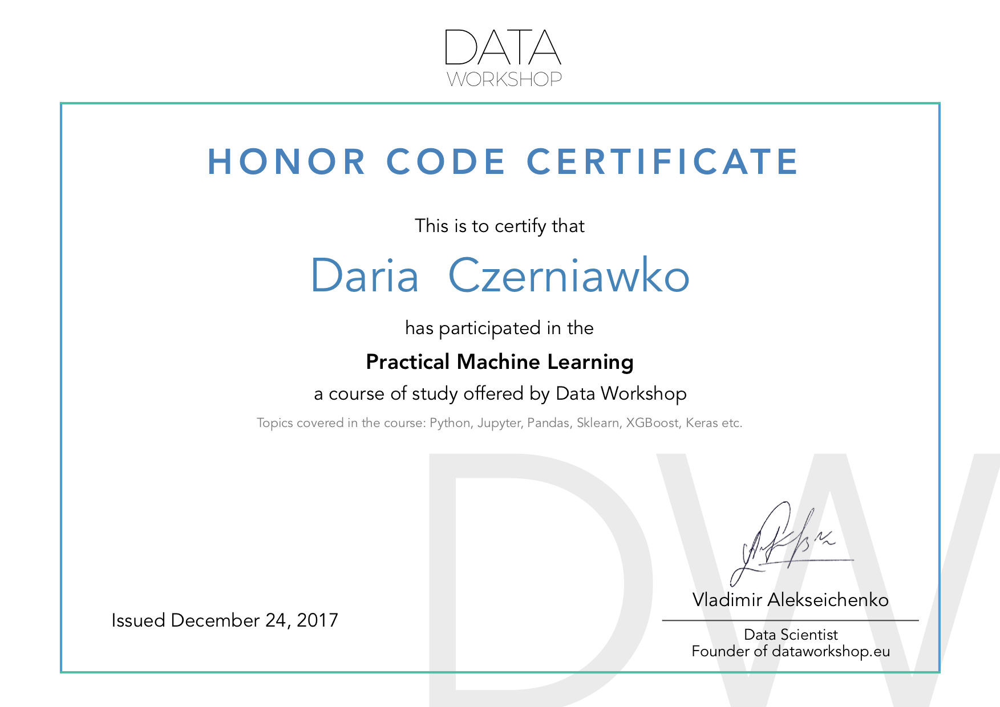

# Portfolio
## Work in progress
Currently I'm working on:
1. [Understanding the Amazon from Space](https://www.kaggle.com/c/planet-understanding-the-amazon-from-space)
2. [Breast Cancer Wisconsin](https://www.kaggle.com/uciml/breast-cancer-wisconsin-data)
3. [Pneumonia Detection Challenge](https://www.kaggle.com/c/rsna-pneumonia-detection-challenge)

## Done projects

Analysis | Machine Learning | Computer Vision | Other
--- | --- | --- | ---
[FIFA 19](fifa_19) | [House Prices](house_prices) | [MNIST](mnist) | [Wallet Explorer Scraper](walletexplorer_scraper)
[Dashboards](dashboards) | [Titanic](titanic)  |  &nbsp;  | [Benchmarks](benchmark)
&nbsp; | [Math for ML](math_for_ml) | &nbsp; | &nbsp;

## Acquired certificates

