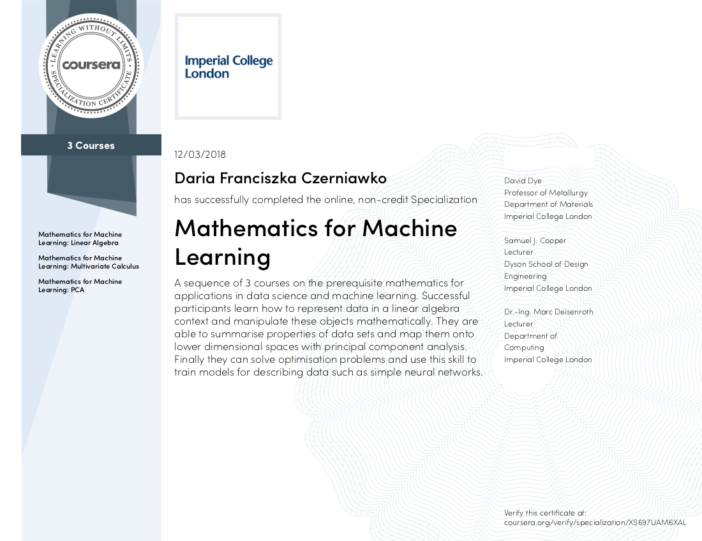

# Portfolio

## Done projects

Analysis | Machine Learning | Computer Vision | Other
--- | --- | --- | ---
[FIFA 19](fifa_19) | [House Prices](house_prices) | [MNIST](mnist) | [Wallet Explorer Scraper](walletexplorer_scraper)
[Dashboards](dashboards) | [Titanic](titanic)  |  [Planet: Understanding the Amazon from Space](https://www.kaggle.com/c/planet-understanding-the-amazon-from-space)  | [Benchmarks](benchmark)
[PetFinder.my Adoption Prediction](https://www.kaggle.com/c/petfinder-adoption-prediction) | [Math for ML](math_for_ml) | &nbsp; | &nbsp;
[NHL](nhl)| [Breast Cancer Wisconsin](https://www.kaggle.com/uciml/breast-cancer-wisconsin-data) | &nbsp; | &nbsp; 
 

## Acquired certificates

