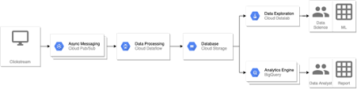

# Recruitment tasks 

## Task “Sessionization”: 
We have a stream from e.g. clickstream, i.e. visit on the website and clicks. Events have a timestamp and a user ID. We would like to count the length of the user's session, i.e. the sequence of events between which is a maximum 30 minutes of break. How would you do it with SQL or Spark? How would you build a pipeline counting such end-of-day sessions from the previous 24 hours? 


I will use SQL (version 1) and PySpark (version 2) to solve the first part of the task. 

1. SQL
```sql
SELECT user_id, SUM(event_interval) AS session_time
FROM (SELECT *, created_at - LAG(created_at,1) OVER (PARTITION BY user_id ORDER BY created_at) as event_interval
      FROM `click_stream`) AS T
WHERE event_interval <= (30 * 60)
GROUP BY user_id
```

2. PySpark
```python
from pyspark.sql.window import Window
import pyspark.sql.functions as psf
window = Window.partitionBy('user_id').orderBy('created_at')
df1 = df.withColumn('lagvalue', psf.lag('created_at',1).over(window))
df2 = df1.withColumn('tsDiff', (psf.unix_timestamp('created_at')-psf.unix_timestamp('lagvalue')))
df3 = df2.filter(df2.tsDiff <= (30*60))
df4 = df3.groupBy('user_id').sum('tsDiff')
```

Demo: https://databricks-prod-cloudfront.cloud.databricks.com/public/4027ec902e239c93eaaa8714f173bcfc/6924332374468580/4390792548882900/7387269749517167/latest.html

Pipeline (I used GCP)

<p align="center">
  
</p>

```sql
SELECT user_id, SUM(event_interval) AS session_time
FROM (SELECT *, created_at - LAG(created_at,1) OVER (PARTITION BY user_id ORDER BY created_at) as event_interval
      FROM `click_stream` WHERE created_at > (NOW() - INTERVAL 24 HOUR)) AS T
WHERE event_interval <= (30 * 60)
GROUP BY user_id
```
## SQL task: 
We have a table in the database with some records that represents user events. The table has two columns: 
* user_id BIGINT column representing the user ID 
* the created_at TIMESTAMP column - the time when the event occurred

How would you use SQL to find such events for each user, followed by no other event for at least a minute? 

```sql
SELECT *
FROM (SELECT *, LAG(created_at) OVER (PARTITION BY user_id ORDER BY created_at DESC) - created_at as event_interval
      FROM `click_stream`) as t
WHERE event_interval >= 60
```